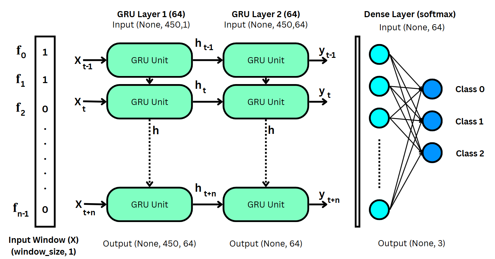

# Drowsiness Detection TFLite

This repository provides code for creating GRU Model for drowsiness detection using a TensorFlow Lite (TFLite). The model predicts drowsiness levels from eye state time series data.

## Features

- Loads binary eye state data from a CSV file.
- Creating GRU-based TFLite model from loaded dataset.
- Outputs predicted drowsiness labels for each window of input data.
- Saves results to a CSV file.

## Folder Structure

```
├── GRU_450_30.ipynb          # GRU Model (.h5) creation
├── convert2tflite.ipynb      # Model conversion from .h5 to .tflite
├── drowsy_gru_450_30.h5      # H5 model file
├── drowsy_gru_450_30.tflite  # TFLite model file
├── dummy.csv                 # Example CSV input
├── results_.csv              # Output predictions (generated)
```

## Model Architecture

The diagram above shows the GRU-based model used for drowsiness detection.

## Requirements

- Python 3.10+
- TensorFlow (tested on 2.15)
- pandas
- numpy

Install dependencies:

```sh
pip install tensorflow pandas numpy
```

## Usage

1. **Prepare your CSV data**  
   Place your binary eye state CSV file in the desired location.

2. **Run the script**  
   Use the following code to perform inference:

   ```python
   import numpy as np
   import pandas as pd
   import tensorflow as tf

   # Load the TFLite model
   interpreter = tf.lite.Interpreter(model_path="your_tflite_model")
   interpreter.allocate_tensors()

   # Get input and output details
   input_details = interpreter.get_input_details()
   output_details = interpreter.get_output_details()

   # Load CSV data
   csv_path = r"your_csv_data_path"
   eye_data = pd.read_csv(csv_path, header=None, index_col=False).squeeze("columns").values.astype(np.float32)

   #Adjust window size based on model need
   WINDOW_SIZE = 450 
   LABELS = ["0", "1", "2"]

   #Prediction
   predictions_list = []
   for i in range(0, len(eye_data) - WINDOW_SIZE + 1):
       window_data = eye_data[i:i + WINDOW_SIZE].reshape(1, WINDOW_SIZE, 1).astype(np.float32)
       interpreter.set_tensor(input_details[0]['index'], window_data)
       interpreter.invoke()
       predictions = interpreter.get_tensor(output_details[0]['index'])
       predicted_class = np.argmax(predictions)
       predictions_list.append(LABELS[predicted_class])

   # Save results
   output_df = pd.DataFrame(predictions_list, columns=["Predicted_Label"])
   output_df.to_csv("results_.csv", index=False)
   ```

3. **Check Results**  
   The predicted labels will be saved in `results_.csv`.

## License

MIT License

---

For questions or contributions, please open an issue or pull request.
